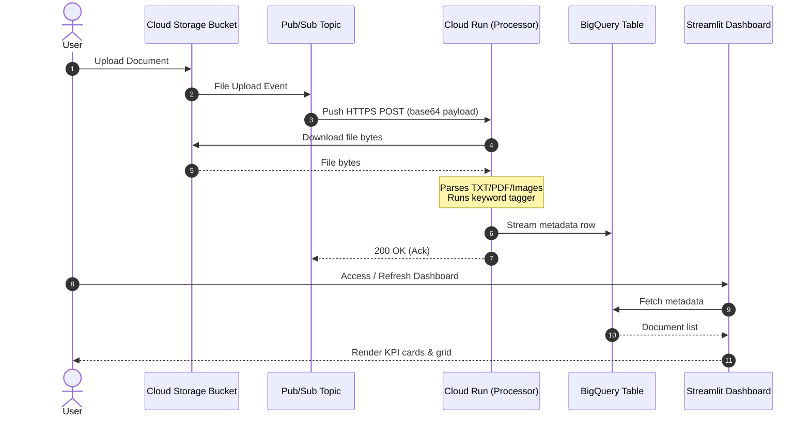

# Google Cloud Serverless Document Ingestion Pipeline

An event-driven, serverless pipeline on Google Cloud Platform (GCP) that automatically ingests uploaded documents, parses them, tags them dynamically, streams their metadata into Google Cloud BigQuery, and visualizes them on a modern Streamlit dashboard.

---

## 🏗️ Architecture

The pipeline uses Google Cloud Storage event notifications, Cloud Pub/Sub, Cloud Run, BigQuery, and Streamlit.



---

## 📂 Project Layout

* **`dashboard/`**: Streamlit client monitoring application ([dashboard/app.py](file:///D:/kaggle/google-cloud-serverless-app/dashboard/app.py)).
* **`processor/`**: Flask web server deployed to Cloud Run that processes document notifications ([processor/app.py](file:///D:/kaggle/google-cloud-serverless-app/processor/app.py)).
* **`scripts/`**: Setup, deployment, testing, and schema utilities:
  * [bq_schema.json](file:///D:/kaggle/google-cloud-serverless-app/scripts/bq_schema.json) - Schema definition for the BigQuery metadata table.
  * [send_mock_payload.py](file:///D:/kaggle/google-cloud-serverless-app/scripts/send_mock_payload.py) - Script to test the processor service locally.
  * [deploy.ps1](file:///D:/kaggle/google-cloud-serverless-app/scripts/deploy.ps1) & [deploy.sh](file:///D:/kaggle/google-cloud-serverless-app/scripts/deploy.sh) - Infrastructure provisioning scripts.

---

## 🛠️ Local Development & Testing

You can run both components locally for development.

### 1. Run the Processor Web Server
Installs dependencies and starts the Flask server on port `8080`:
```bash
# Install dependencies
pip install -r processor/requirements.txt

# Start Flask
python processor/app.py
```

### 2. Test Processing with a Mock Payload
While the local processor is running, send a mock Pub/Sub file upload notification using the testing script:
```bash
python scripts/send_mock_payload.py --file scripts/test_doc.txt --port 8080
```
This reads the local file, wraps it in a simulated Pub/Sub event envelope, and POSTs it to the processor.

### 3. Run the Monitoring Dashboard
Ensure you have authenticated with your Google Cloud account via Application Default Credentials (ADC) to allow BigQuery queries:
```bash
gcloud auth application-default login
```
Then start Streamlit:
```bash
# Install dependencies
pip install -r dashboard/requirements.txt

# Start Streamlit
streamlit run dashboard/app.py
```
Open **[http://localhost:8501](http://localhost:8501)** in your browser.

---

## 🚀 Cloud Deployment

The deployment script configures GCS buckets, Pub/Sub notifications, service accounts, Cloud Run deployment, and BigQuery tables.

Ensure your Google Cloud SDK is authenticated and the active project is set:
```bash
gcloud auth login
gcloud config set project [YOUR_PROJECT_ID]
```

### Deploy using PowerShell (Windows):
```powershell
./scripts/deploy.ps1
```

### Deploy using Bash (Linux/macOS):
```bash
chmod +x scripts/deploy.sh
./scripts/deploy.sh
```
